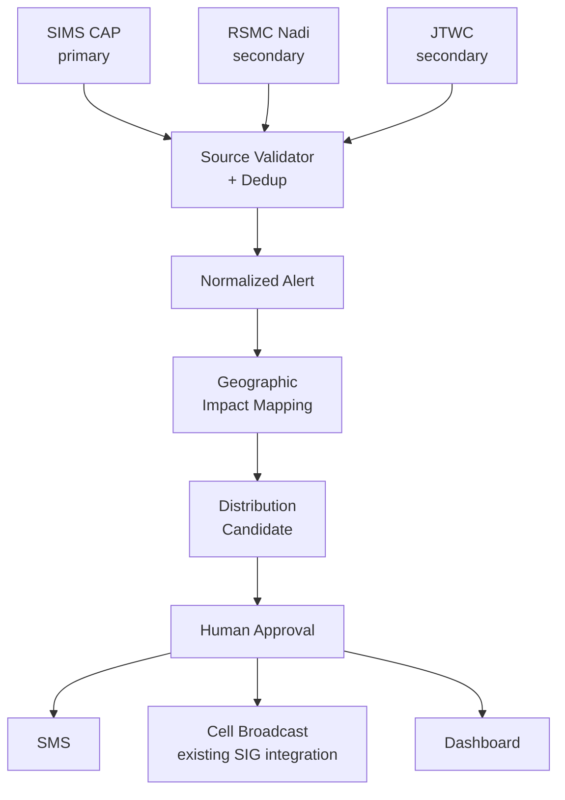

# SI Hazard-Warning Distribution System

Multi-channel hazard-warning distribution and geographic-targeting system for Solomon Islands. Ingests authoritative warnings (SIMS primary; RSMC Nadi and JTWC secondary), maps them to administrative geography, and routes approved alerts through SMS, Cell Broadcast and other channels.

> **Scope boundary:** this system does not issue meteorological warnings, predict cyclone formation, or generate hydrological forecasts. It ingests authoritative information, maps it, prepares channel-specific messages, and distributes only what a human has approved.

Related project: [DataViz-V1](https://github.com/ReversalRedGarnet/DataViz-V1) (cyclone data visualisation) — this repo reuses its CAP parsing logic as a shared module rather than duplicating it.

## Why

Solomon Islands has 567,000 active cellular connections vs 358,000 internet users (DataReportal, Digital 2026). SMS/Cell Broadcast reaches far more people than any app-based solution would. The country already has warning channels — a SIMS CAP feed, radio, NDMO coordination, a piloted Cell Broadcast system with SIG ICT Services. The gap isn't a missing channel; it's interoperable, machine-readable, geographically-targeted orchestration across the channels that already exist.

## Architecture

```
ingest → validate → map → prepare → route
```

The software never decides a warning exists — that authority stays with SIMS/NDMO. A human approves before anything sends.



Ingestion and geographic mapping are pure software with no external dependency — build these first. Distribution depends on partnerships: an SMS aggregator first, then whatever Cell Broadcast infrastructure SIG ICT Services already runs.

## Data sources

- **Primary:** Solomon Islands Meteorological Service (SIMS) CAP feed — `https://cap-sources.s3.amazonaws.com/sb-met-en/rss.xml`, signed CAP 1.2 XML (XML-DSig, RSA-SHA256). Verified live 22 Sep 2026.
- **Secondary:** RSMC Nadi, JTWC — cross-checking and historical analysis only, never the trigger for public dissemination.
- **Manual fallback:** operator-entered alert path for when digital feeds fail (requires source/reference, operator identity, approval, full audit trail).

## Domain model

Generic, not cyclone-shaped — a multi-hazard distribution system. Downstream components depend on a normalized `Alert` contract, never raw CAP objects.

```
HazardSource
 ├── SIMSCAPAdapter             (primary)
 ├── RSMCNadiAdapter            (secondary)
 ├── JTWCAdapter                (secondary)
 ├── ManualOfficialAlertAdapter (operator-entered)
 └── future hazard adapters
```

`Alert` schema: `alert_id, event_id, hazard_type, sender, source, status, msg_type, severity, urgency, certainty, effective, expires, alert_areas[], instructions, references[], source_intensity, source_wind_speed, source_category, normalized_intensity, authoritative_for_local_warning, raw_payload, source_metadata, raw_source_url, retrieved_at, payload_hash`

## Status

- [x] SIMS confirmed as primary CAP source (WMO-registered), RSMC Nadi secondary
- [x] SIMS CAP feed verified live — signed Strong Wind alerts currently publishing
- [x] Repo structure decided — own repo, reusing DataViz-V1 parsing as a shared module
- [x] Boundaries for prototype — Pacific Data Hub 2009 province-level (request current SINSO boundaries before production)
- [x] SMS provider for MVP — BudgetSMS (production provider still open)
- [ ] Warning-approval authority (NDMO / Met Service / ICT Services) — not yet confirmed
- [ ] SIG ICT's existing Cell Broadcast integration scope — not yet confirmed
- [ ] Cyclone-category CAP example — only Strong Wind alerts seen so far

Full context, open questions, partnership contacts and sourcing: see [`docs/PROJECT_HANDOFF.md`](docs/PROJECT_HANDOFF.md).

## Build order

0. **Discovery** — verify SIMS CAP behaviour, map SIMS/NDMO approval workflow, find out what SIG ICT's Cell Broadcast integration covers *(in progress)*
1. **Warning ingestion** — SIMS CAP (primary), RSMC Nadi + JTWC (secondary), manual entry path
2. **Normalization** — dedup, alert lifecycle state machine, source hierarchy
3. **Geographic mapping** — warning geometry against province/constituency/ward
4. **Replay testing** — against Tropical Cyclone Maila (Apr 2026) as a stand-in dataset
5. **SMS pilot** — BudgetSMS, both networks, delivery-test matrix, idempotency/retry tests
6. **Human-approval workflow** — roles, MFA, audit log
7. **Government validation** — SIMS, NDMO, SIG ICT Services
8. **Cell Broadcast integration** — with existing SIG/Our Telekom infrastructure
9. **Flood/hydrology** — scoped separately (see handoff doc)
10. **Damage assessment** — only after mapping existing IEDCR/NDMO workflow

## Repo layout

```
/src
  /ingestion       # HazardSource adapters (SIMSCAPAdapter, etc.)
  /normalization   # Alert schema, dedup, lifecycle state machine
  /geo             # boundary data, polygon-to-province mapping
  /distribution    # SMS, Cell Broadcast, dashboard routing
  /shared          # reused DataViz-V1 parsing module
/docs
  PROJECT_HANDOFF.md
/tests
```

## License

TBD.
