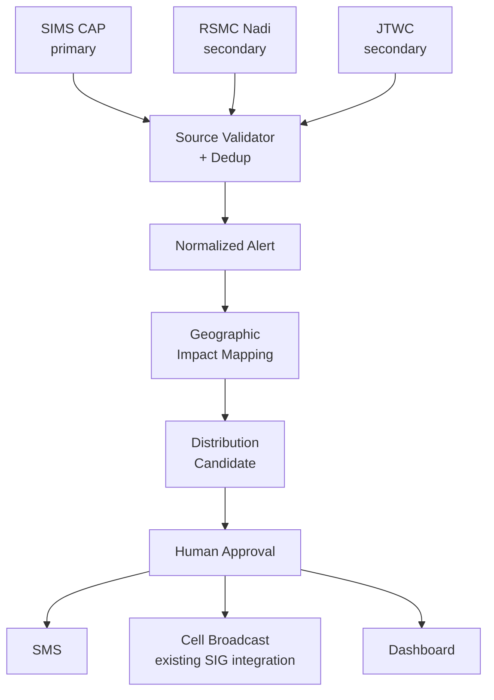

# SI Hazard-Warning Distribution System — Project Handoff

2026-09-22 · @Someone

## Overview

Multi-channel hazard-warning distribution and geographic-targeting system for Solomon Islands: ingests authoritative warnings (SIMS primary; RSMC Nadi and JTWC secondary), maps them to administrative geography, and routes approved alerts through SMS, Cell Broadcast and other channels. SMS is the initial pilot channel, not the whole system.

Scope boundary: the system does not independently issue meteorological warnings, predict cyclone formation, or generate hydrological forecasts — it ingests authoritative information, maps it, prepares channel-specific messages, and distributes only what a human has approved.

Sibling: a post-disaster damage-reporting tool for provincial officers — scope it only after checking for overlap with existing World Bank IEDCR and NDMO/MPGIS systems (see below).

## Problem & need

Mobile connectivity is substantially broader than internet use: 567,000 cellular connections were active in late 2025 versus 358,000 internet users (DataReportal, Digital 2026: Solomon Islands). That's a connection count, not unique-person coverage, and a subscription doesn't guarantee tower or power availability during an event — but it's still the strongest case for SMS/Cell Broadcast over an app-store solution, which would exclude most of the country outright.

Solomon Islands already has multiple warning channels: a SIMS CAP feed, radio, NDMO coordination under the 2018 National Disaster Management Plan, and a piloted Cell Broadcast system already integrated with SIG ICT Services. The gap isn't the absence of a channel — it's interoperable, machine-readable, geographically-targeted orchestration across those existing channels and agencies. SIG's ICT Services Strategy 2026-2030 names exactly this: EWS-supporting technology, GIS/data-exchange platforms, interoperability and data governance are stated priorities.

SIBC (the national broadcaster) is NDMO's own description of its "traditional early warning system partner" — but its own officials acknowledge SIBC doesn't reliably reach far-flung islands, and a 2013 Japan-funded shortwave transmitter investment meant to fix that "has not been functioning as planned" for a decade. That's a caution against over-relying on any single existing channel, radio included, and another reason a machine-readable, multi-channel layer is worth building rather than assuming radio alone covers the gap.

## Architecture overview

The software's job is ingest → validate → map → prepare → route; it never decides a warning exists — that stays with SIMS/NDMO. A human approves before anything sends.



Ingestion and geographic mapping are pure software — no external dependency, build first. Distribution depends on partnerships: an SMS aggregator first, then discovering and integrating with whatever Cell Broadcast infrastructure SIG ICT Services already runs (don't assume you're building it from scratch).

## 1. Data ingestion

Primary source: the Solomon Islands Meteorological Service (SIMS). SIMS exposes a CAP feed and is listed as an official alerting authority in the WMO Register of Alerting Authorities — confirm it's stable in practice, but it's the correct primary path: ingest and validate official SIMS CAP alerts first, with a bulletin/HTML parser as fallback.

Verified live (22 Sep 2026): the SIMS CAP feed is real and active — RSS index at `https://cap-sources.s3.amazonaws.com/sb-met-en/rss.xml`, each item linking to its own signed CAP 1.2 XML (XML-DSig, RSA-SHA256, with an embedded X.509 cert — useful for source authentication, not just payload hashing). Recent items are all Strong Wind warnings, reissued every few hours to \~1 day while conditions persist. Confirmed structure: `status=Actual`, `msgType=Alert` (SIMS does not appear to use `Update`/`Cancel` in practice — see the lifecycle note below), `scope=Public`, populated `severity`/`urgency`/`certainty`, a free-text `areaDesc` plus a `polygon` (no administrative geocode — polygon-to-boundary intersection is required, as planned), an `instruction` block in plain English, and a `web` link that currently points to a Facebook group rather than met.gov.sb. Still open: no cyclone-category example seen yet (only Strong Wind so far), so cyclone-specific fields (wind radii, track) need verifying against a live or archived TC bulletin.

Secondary/situational: RSMC Nadi and JTWC — useful for cross-checking and historical analysis, not the source that should trigger public dissemination. If SIMS stops publishing, surface a SOURCE INTERRUPTION state rather than silently promoting a secondary source to primary authority.

Domain model: generic, not cyclone-shaped. The project is a multi-hazard warning distribution system, so downstream components should depend on a generic `Alert` contract — not on CAP objects and not on cyclone-specific fields. That lets the same routing engine later handle heavy rain, flood, tsunami or other official warnings without a rewrite.

```
HazardSource
 ├── SIMSCAPAdapter            (primary)
 ├── RSMCNadiAdapter           (secondary)
 ├── JTWCAdapter               (secondary)
 ├── ManualOfficialAlertAdapter (operator-entered, for when digital feeds fail — requires source/reference, operator identity, approval, full audit trail)
 └── future hazard adapters
```

Precedent for the manual path: during TC Beni (2003), SIMS/NDC issued 21 warnings as the storm crossed, and NDMO reached remote islands by directly contacting a local radio station and the provincial police commander — the same human-relay pattern `ManualOfficialAlertAdapter` should formalize rather than replace.

Each adapter populates one normalized `Alert` — never a raw CAP object downstream. The canonical schema:

`alert_id, event_id, hazard_type, sender, source, status, msg_type, severity, urgency, certainty, effective, expires, alert_areas[] (polygon/circle/geocode), instructions, references[], source_intensity, source_wind_speed, source_category, normalized_intensity, authoritative_for_local_warning, raw_payload, source_metadata, raw_source_url, retrieved_at, payload_hash`

`event_id` matters beyond ingestion — it's what would eventually link a warning to a damage-assessment record (see the sibling-tool section) rather than starting a second, disconnected identifier scheme.

Validate CAP's own fields on ingest (sender, identifier, status, msgType, scope, severity, urgency, certainty, area) and keep the raw payload as an audit trail. Track SOURCE\_HEALTH (healthy/delayed/stale/unavailable) and flag stale data — a feed last updated hours ago should never be treated as current.

This also makes the DataViz-V1 parsing work directly reusable.

## 2. Geofencing

Map the official warning's geometry, not a storm cone — a forecast track cone isn't a hazard footprint; rain, surge and wind can extend well outside it. Prioritize CAP's own `alert_areas` (polygon/circle/geocode) when SIMS publishes them; fall back to cone/distance logic only when no official geometry is available. Don't score severity by distance from the track — retain the source's own severity/urgency/certainty instead of inventing a local proxy.

Boundary data: the Pacific Data Hub has a Solomon Islands administrative-boundary dataset (enumeration areas, wards, constituencies, provinces) — downloadable, CC-BY, but built on the 2009 census; SPC warns upper-level boundaries may differ from current official ones, and current programs (e.g. the 2026 malaria-elimination roadmap) already report by constituency/ward.

Hierarchy: Country → Province → Constituency → Ward.

Edge case: don't force this into one rigid tree. Honiara City Council is administratively distinct from Guadalcanal Province, and both have ward-level structures — model `AdministrativeUnit` as a typed graph/tree (`id, unit_type` \[province/constituency/ward/city/etc.\], `parent_id`, `geometry`, `dataset_version`) with parent relationships, rather than assuming every unit is a province's child.

- Prototype: Pacific Data Hub 2009 boundaries, province-level geofencing only.
- Production: request current authoritative boundaries from SINSO, electoral authorities, or provincial-government GIS/admin offices — don't treat an OSM-derived boundary as authoritative just because it's convenient.

Store versioned provenance so an old alert can be reconstructed against the geometry that existed when it was sent: `dataset_id, source_agency, version, effective_from, effective_to, retrieved_at, license, geometry_hash, verification_status`. Label the prototype dataset aggressively — `BOUNDARY_STATUS = DEVELOPMENT_ONLY` in code, plus a UI banner: "Development boundary dataset — not approved for operational warning dissemination."

Administrative boundaries are routing units, not hazard units — for later situational awareness, intersect official warning areas with exposure layers to answer who and what is affected, not just which routing unit fires:

- Population grid / exposed population estimate
- Settlements and communities
- Schools
- Health facilities
- Evacuation centres
- Roads, ports and other critical infrastructure

SIG's ICT Strategy already plans for this under GIS visualisation and integration with government/external datasets.

## 3. Subscriber management

Key constraint: international SMS aggregators serving +677 numbers (SMS.to, D7 Networks, BudgetSMS) are outbound-only — two-way SMS is not supported through those routes. Fine for a broadcast alert, but it rules out "reply STOP to unsubscribe" or "reply SAFE to confirm" without a direct telco integration.

Opt-in options for v1:

- Provincial ICT Assistants — a potential registration/administrative-support channel, not a documented responsibility. The government description of the ICT Assistant program covers ICT troubleshooting, data management and network support; using them for subscriber collection needs NDMO/MPGIS approval and defined consent procedures, not an assumption.
- A simple web form for the \~42% with internet access, shared via radio/church/community noticeboards for the rest.

Store subscribers tagged by province/ward so alerts can be targeted to the geofenced area, not blasted nationwide.

A subscriber's registered province/ward is their registered alert zone, not their live location — someone registered in Honiara could be in Malaita when a warning fires, and SMS can't fix that. It's one more reason Cell Broadcast (geographic, not address-book based) matters for actual coverage, not just redundancy.

Subscriber data is personal data and falls under SIG's own 2026-2030 privacy/data-protection priorities. Keep the table minimal: `phone_number, registered_alert_zone, consent_status, registration_source, timestamps, status` — avoid collecting names or other personal attributes unless operationally required and separately approved. Never put real numbers, test data or gateway credentials into GitHub.

## 4. Distribution

Operators: Our Telekom and Bmobile-Vodafone. Vendor-reported estimates (D7's SI page) put Our Telekom at \~60% and Bmobile at \~40% — verify against TCSI/GSMA before using in a formal proposal. The point that actually matters: Our Telekom claims the largest mobile footprint and SIG named it lead operator for the Cell Broadcast pilot. Sender ID registration not required. Keep messages under 160 characters (GSM-7) — one segment, one price.

No fresher public split found on this pass — TCSI's own Market & Competition unit does publish this data, but the most recent easily-found report online is from 2020; the 60/40 figure stands unverified beyond the vendor page until someone pulls TCSI's current annual/quarterly report directly.

Sample alert: "CYCLONE WARNING: \[Name\] Cat \[X\] expected near \[Province\] \[time\]. Move to higher ground. Info: \[short link/number\]"

| Gateway | Price/SMS | Notes |
| --- | --- | --- |
| BudgetSMS | €0.037 (BeMobile) / €0.048 (Breeze) | Full wholesale coverage, only partial direct coverage; filtering issues unknown — MVP choice |
| D7 Networks | $0.13 | Confirms two-way SMS unsupported in SI; concatenation supported |
| SMS.to | Get a direct SI quote | Headline $0.023 is a generic rate, not SI-specific — don't budget on it |

Build a swappable provider layer, don't hard-code a gateway:

```
NotificationService
 ├── BudgetSMSProvider     (MVP)
 ├── D7Provider            (fallback/benchmark)
 └── CellBroadcastProvider (parallel channel — see below)
```

Watch out for vendor metadata errors, not just prices — BudgetSMS's own Solomon Islands page shows the country prefix as +667 rather than +677. Don't trust vendor country data without testing the real route.

Before trusting any gateway, run a formal delivery-test matrix — Operator × Device × Location × Message type (Our Telekom, Bmobile; basic phone, smartphone; urban, provincial) — and record `submit_time, accept_time, delivery_time, failure_reason, provider_route, operator, message_segments`. Test the premium/direct route too, not just wholesale — you want empirical SI delivery evidence, not a vendor's generic reliability claim.

The delivery chain has more failure points than "gateway unavailable": server → internet → international gateway → transit → SI operator interconnect → SMS centre → tower → handset — and several of those can fail independently during a disaster (tower damage, local power loss, backhaul failure). The new Adamasia cable improves international redundancy but doesn't fix any of that locally. An external SMS API can't be the only path in production: plan primary (a controlled/local path), secondary (the aggregator), tertiary (Cell Broadcast or existing government infrastructure), with local queueing so the system keeps working if an upstream provider drops.

Add outbound idempotency — a timeout after a gateway accepts a request can cause a retry and duplicate delivery. Track a stable key per alert × recipient × channel:

`OutboundMessage: alert_id, recipient_id, channel, provider, idempotency_key, attempt, provider_message_id, status (QUEUED / SUBMITTED / ACCEPTED / DELIVERED / FAILED / UNKNOWN)`

And keep two concepts separate: provider delivery telemetry shows the network reported delivery, not that a person saw, understood or acted on the message. Don't conflate the two in any evaluation of the pilot.

Message construction needs its own subsystem, not just a character-count check: template → localization → encoding detection → segment count → preview → approval, rejecting anything that unexpectedly crosses a segment boundary (a single Unicode character can do it). Support English and Pijin through human-approved templates — don't machine-translate emergency instructions.

Cell Broadcast — investigate before building. Solomon Islands ran the first live Cell Broadcast test in the Pacific in May 2025, led by Our Telekom, and UNDRR's case study says that pilot was hosted within SIG ICT Services and already integrated with outputs from multiple warning agencies — this may not be something to build from scratch. Before writing a `CellBroadcastProvider`, get from SIG ICT: the current architecture diagram, integration/API/interface spec, message schema and channel constraints, geographic-targeting mechanism, authentication/authorization model, operational owner, current rollout status, and existing SOP/approval workflow. The key question: at what exact technical interface does an authorized government warning enter the existing Cell Broadcast system? Don't invent a parallel authorization model either — the Pacific CB work already involves NDMO, SIMS, SIG ICT Services and the mobile operators; integrate with that control model rather than building an incompatible one. If a genuine gap remains, the framing stays: "we build the alert-detection and geographic-targeting layer that feeds existing SI warning channels" — not "we invented emergency alerting."

More specifics surfaced: NDMO's own director says the cell-broadcast rollout is "once new telecommunications towers are operational" and depends on finance to cover all provinces — real, but not yet nationwide. It sits under the broader Pacific-wide GSMA/PITA Early Warnings for All (EW4All) push, with SPREP's Weather Ready Pacific programme also named as a delivery partner. SIMS itself has a named contact already involved: senior forecaster Alex Rilifia completed a Japan-funded UNITAR early-warning-systems programme (2024–2025) and helped demonstrate the SI cell-broadcast pilot at the PITA AGM and Osaka Expo 2025 — a concrete person to start the Phase 0 discovery conversation with, rather than a generic "contact SIG ICT."

## Governance, security & operating modes

Warning determination stays with SIMS/NDMO — the system never independently decides a warning exists or issues an all-clear. An all-clear must come from an authorized source, not inferred from storm geometry: NDMO kept emergency operations active past cancelled weather warnings during the Jan–Feb 2026 response for exactly this reason.

An alert lifecycle state machine (NEW → WATCH → WARNING → ESCALATED → UPDATED → CANCELLED/ALL CLEAR) with explicit send-triggers (new warning, severity increase, affected-area increase, material forecast change, cancellation) is required — polling every 15 minutes with no update-suppression will train people to ignore the channel.

Confirmed in the live feed: SIMS reissues a fresh `Alert` (new identifier, no `references` back to the prior one) roughly every 6–24 hours during ongoing conditions rather than sending a formal `Update` — so dedup can't rely on `msgType`; match on `eventCode`/headline pattern and overlapping validity window instead.

Roles: Viewer / Operator / Approver / Administrator, with two-person approval for any public broadcast — an operator can't approve their own send. This is a system where a compromised admin panel could send a false evacuation order to thousands of people, so add MFA, RBAC, an immutable audit log, rate limits and encrypted storage. SIG's own ICT Strategy already names data security, access control and encryption as 2026-2030 priorities — this isn't extra scope, it's alignment.

Approval isn't one-size-fits-all — define profiles with the actual authorities rather than assuming uniform two-person review: a trusted official relay (fast), a transformed/localized message (needs review), and a manually authored emergency message (needs the strongest approval). Whether an official alert may ever be relayed automatically is a government operating-policy decision, not something the software decides on its own.

Threat model to design against: compromised admin account, stolen SMS/API credential, spoofed or untrusted source feed, replay of an old warning, malicious insider or unauthorized operator, duplicate delivery from retry/failover, corrupted boundary dataset, a source outage misread as "no warning," and database/configuration loss. Map each threat to a control and a testable acceptance test — MFA, RBAC, audit logging, encryption, rate limiting and secret management all need something that proves they work, not just that they exist. Hashing a payload gives integrity/audit value; it doesn't by itself authenticate the source.

Three environment modes — DEVELOPMENT, TEST, PRODUCTION — with TEST always routing to a synthetic recipient list, never real subscriber numbers, so nobody can broadcast a real warning from a laptop by accident.

## Reliability & recovery

Source health (healthy/delayed/stale/unavailable) is only useful if someone is told when it changes — add active monitoring, internal notification and dashboard state; a silent source outage must never look like "no current warning."

Define RTO (how fast the system must recover after an outage) and RPO (how much operational/audit data can be lost) — these drive backup, replication and deployment decisions, not the other way around.

Plan for manual degraded operation: when the internet, CAP endpoint or gateway is down, operators still need a safe way to record an official warning and its status, even if dissemination happens through an external or human-managed channel.

When sources disagree — SIMS has a local warning but RSMC or JTWC shows a different intensity — show the disagreement to the operator for context, while keeping the official-source hierarchy for what actually goes out to the public.

## Testing & acceptance criteria

Historical replay should be a headline capability, not an afterthought: run real historical warning sequences (Tropical Cyclone Maila is a good first case) through the full pipeline and measure affected areas, false/missed routing, processing latency, deduplication and update handling — before waiting for a live cyclone to find out if it works.

Minimum acceptance tests before calling this pilot-ready:

1. A valid SIMS CAP alert is ingested and stored with provenance.
2. Malformed or untrusted input is rejected or quarantined.
3. Duplicate input doesn't generate duplicate public alerts.
4. An update modifies the correct existing event.
5. A cancellation doesn't become an inferred all-clear.
6. Official warning geometry maps to the intended geographic units.
7. Honiara and provincial boundaries are handled correctly.
8. TEST mode cannot send to production recipient lists.
9. Unauthorized users cannot approve a public broadcast.
10. Provider retries can't create duplicate sends.
11. Stale source data produces a SOURCE INTERRUPTION state.
12. A historical event can be replayed deterministically.

Delivery success isn't the finish line — include comprehension and last-mile testing in the pilot: what participants think the message means, what action it asks for, whether the English/Pijin wording is clear, and whether they trust the source. Include at least one provincial/remote-community test where feasible.

## Related sibling idea: damage reporting tool

A lightweight post-disaster damage reporting tool for provincial officers — cheap to build, sits naturally alongside this project and the ICT Assistants now being deployed to provinces. Not scoped in detail yet; worth a follow-up session once the alert pipeline is running, since it can likely reuse the same subscriber/province data model.

Scope note: this pipeline detects cyclone threat, not independent river/flash-flood events. A flood-warning module needs its own rainfall/hydrology trigger source — don't assume floods can be inferred from cyclone tracks alone.

Before building the damage-reporting tool: map the existing World Bank IEDCR program (provincial MIS, field devices, climate/disaster data collection) and the ICT Assistant program's actual scope — this may already exist in some form. A shared `event_id` linking the warning system to a damage-assessment module would be more valuable than a fresh standalone tool.

Flood has three different possible systems, worth keeping distinct: (A) redistributing SIMS's own official heavy-rain/flood warnings — feasible now, the same pipeline as cyclone; (B) flood-risk estimation from rainfall + catchment + terrain — needs real hydrology work; (C) real-time detection from river/rain gauge telemetry — needs physical infrastructure (World Bank's Guadalcanal flood-warning work already identified this). For v1, scope the promise to cyclone & severe-weather distribution, not "flood early warning" in the same sense as the cyclone module — (A) can follow once SIMS's flood-warning CAP output is confirmed.

## Build order / roadmap

0. **Discovery** — verify SIMS CAP behaviour, map the SIMS/NDMO warning and approval workflow, find out what SIG ICT's existing Cell Broadcast integration actually covers, and inventory existing IEDCR/NDMO damage-reporting systems. Do this before writing code — it changes what you build.
1. **Warning ingestion** — SIMS CAP (primary), RSMC Nadi + JTWC (secondary), plus a manual official-alert entry path for when digital feeds fail; source validation and provenance throughout.
2. **Normalization** — dedup, alert lifecycle state machine, explicit source hierarchy.
3. **Geographic mapping** — official warning geometry against province/constituency/ward; boundaries versioned and labeled development-only.
4. **Replay testing** — run the pipeline against Tropical Cyclone Maila (5–11 April 2026): SIMS Warning Numbers Two through at least Eighteen, Western/Choiseul/Isabel/Guadalcanal/Central provinces affected, sourced from ReliefWeb/ECHO/OCHA situation reports and local reporting (indepthsolomons.com.sb) as a stand-in dataset while the live CAP archive is checked for the same period; report false/missed province alerts and per-stage latency.
5. **SMS pilot** — BudgetSMS, both networks, a real delivery-test matrix, plus idempotency and retry-duplicate tests.
6. **Human-approval workflow** — roles, MFA, audit log.
7. **Government validation** — SIMS, NDMO, SIG ICT Services.
8. **Cell Broadcast integration** — with whatever SIG ICT/Our Telekom already runs, not a rebuild.
9. **Flood/hydrology** — scoped separately from cyclone distribution (see flood tiers above).
10. **Damage assessment** — only after mapping the existing IEDCR/NDMO workflow.

## Partnership & funding angle

- SIG ICT Services Digital – Data, People, Technology and Cyber Strategy 2026-2030 (DFAT-funded) — natural home for a pitch; provincial digitisation is explicit, ICT Assistants already deployed.
- NDMO (National Disaster Management Office) and the Solomon Islands Meteorological Service — institutional partners for alert content, authority and legitimacy.
- Our Telekom — locally controlled operator (via SINPF / Investment Corporation of Solomon Islands), already leading SI's Cell Broadcast pilot; the highest-value long-term partner.
- GSMA / PITA / Omnitouch regional initiative — the existing stakeholders behind SI's Cell Broadcast deployment; integrate with them rather than building a parallel system.
- UNDP and World Bank have both run digital-transformation and e-government technical-assistance programs in SI — worth checking current calls.
- Correction: the earlier "SICCI/Westpac grants" line doesn't check out — SICCI's actual annual event is the Business Excellence Awards, which include an Innovation & Technology category, but it's a recognition award (nominations typically Sept–mid-Oct, judged submissions), not a funding grant. Worth entering for visibility, not counted on as a funding source.
- UNDRR — published a Solomon Islands early-warning case study covering the SIG ICT/Cell Broadcast integration; useful for understanding what already exists before building anything new.
- World Bank IEDCR programme — already funded provincial MIS and damage-data infrastructure; check before building the damage-reporting sibling.

## Open questions / next decisions

- [x] Superseded: SIMS — not RSMC Nadi — publishes a CAP feed and is WMO-registered. SIMS CAP is now the primary ingestion source (see Data ingestion); RSMC Nadi and JTWC remain secondary.
- [x] Resolved: use Pacific Data Hub 2009 boundaries for the prototype (province-level); request current authoritative ward/constituency boundaries from SINSO before production.
- [x] Resolved for MVP: BudgetSMS. Production provider still undecided — pending real SI delivery testing across both networks.
- [x] Decide repo structure — own repo, or a module inside DataViz-V1?

  Resolved: own repo, reusing DataViz-V1's parsing logic as a shared module.
- [ ] Who is authorized to declare an official warning, and who is allowed to press Send? (NDMO / Met Service / ICT Services)
- [ ] Scope and fund a separate rainfall/hydrology trigger source for flood warnings — not inferable from cyclone tracks
- [ ] Get a direct SI-specific quote from SMS.to for comparison
- [x] Resolved (22 Sep 2026): SIMS CAP feed confirmed live at https://cap-sources.s3.amazonaws.com/sb-met-en/rss.xml, currently publishing signed Strong Wind alerts. Still to verify: cyclone-category example, and the warning-approval workflow directly with SIMS/NDMO.
- [ ] Find out what SIG ICT Services' existing Cell Broadcast integration actually covers before building a CellBroadcastProvider
- [ ] Inventory existing IEDCR/NDMO/MPGIS damage-reporting systems before building the sibling tool
- [ ] Confirm the institutional warning-source hierarchy (SIMS vs RSMC vs JTWC) directly with SIG/NDMO/SIMS
- [ ] Decide the message-template approach for English/Pijin (human-approved templates, not machine translation)
- [ ] Reach out to Alex Rilifia (SIMS senior forecaster, involved in the SI Cell Broadcast demo at PITA AGM/Osaka Expo 2025) as a concrete Phase 0 discovery contact
- [ ] Confirm the province-by-province timeline for Cell Broadcast tower rollout with NDMO — it's finance-gated and not yet nationwide
- [ ] Pull TCSI's current annual/quarterly market report directly for a real Our Telekom/Bmobile subscriber split
- [ ] Check whether the ABU Academy's Solomon Islands early-warning training (covering CAP implementation specifically) has materials or contacts worth following up

Convention: items above marked "Resolved"/"Superseded" are working decisions for the prototype, not institutional authorization — don't treat a technically workable answer as government sign-off. As real answers come in from SIMS/NDMO/SIG ICT, give each open item an owner, the evidence needed, and a decision date.

## Sources

- [WMO — Common Alerting Protocol](https://wmo.int/site/wmo-common-alerting-protocol/about-cap)
- [WMO Register of Alerting Authorities — Solomon Islands Meteorological Service](https://alertingauthority.wmo.int/authorities.php?recId=229)
- [Solomon Islands Meteorological Service](https://met.gov.sb/)
- [UNDRR — mobile technology / inclusive early-warning case study for Solomon Islands](https://www.undrr.org/resource/case-study/mobile-technology-expanding-inclusive-early-warning-communication)
- [PITA — Pacific Cell Broadcast early-warning demonstration](https://www.pita.org.fj/article/breakthrough-for-smart-blue-continent-pacific-cell-broadcast-based-early-warning-system-showcased/)
- [GSMA — advancing mobile early warnings at scale in the Pacific](https://www.gsma.com/solutions-and-impact/connectivity-for-good/mobile-for-development/blog/advancing-mobile-early-warnings-at-scale-a-regional-partnership-model-for-the-pacific-islands/)
- [SIG ICT Strategy 2026-2030 (PDF)](https://solomons.gov.sb/wp-content/uploads/2025/09/SIG-ICTS-Digital_final.pdf)
- [Solomon Islands Government — disaster management / meteorology](https://solomons.gov.sb/ministry-of-environment-climate-change-disaster-management-and-meteorology/)
- [Pacific Data Hub — Solomon Islands administrative boundaries](https://pacificdata.org/data/dataset/2009_slb_phc_admin_boundaries)
- [World Bank — IEDCR documentation (PDF)](https://documents1.worldbank.org/curated/en/099040623230514149/pdf/P1736880c274420cc0a9b207db2ac201a1e.pdf)
- [WMO — SIEWAP regional programme](https://wmo.int/activities/projects/project-portfolio/scale-inclusive-early-warning-and-action-pacific-crews-siewap)
- [WMO — Pacific Early Warning Systems for Floods (EWS-F)](https://wmo.int/events/community-event/pacific-early-warning-systems-floods-ews-f-project-update-meeting)
- [DataReportal — Digital 2026: Solomon Islands](https://datareportal.com/reports/digital-2026-solomon-islands)
- [BudgetSMS — Solomon Islands pricing](https://www.budgetsms.net/sms-gateway-pricing/sb/solomon-islands/)
- [D7 Networks — Solomon Islands SMS](https://d7networks.com/sms/solomon-islands/)
- [Twilio — Solomon Islands SMS guidelines](https://www.twilio.com/en-us/guidelines/sb/sms)
