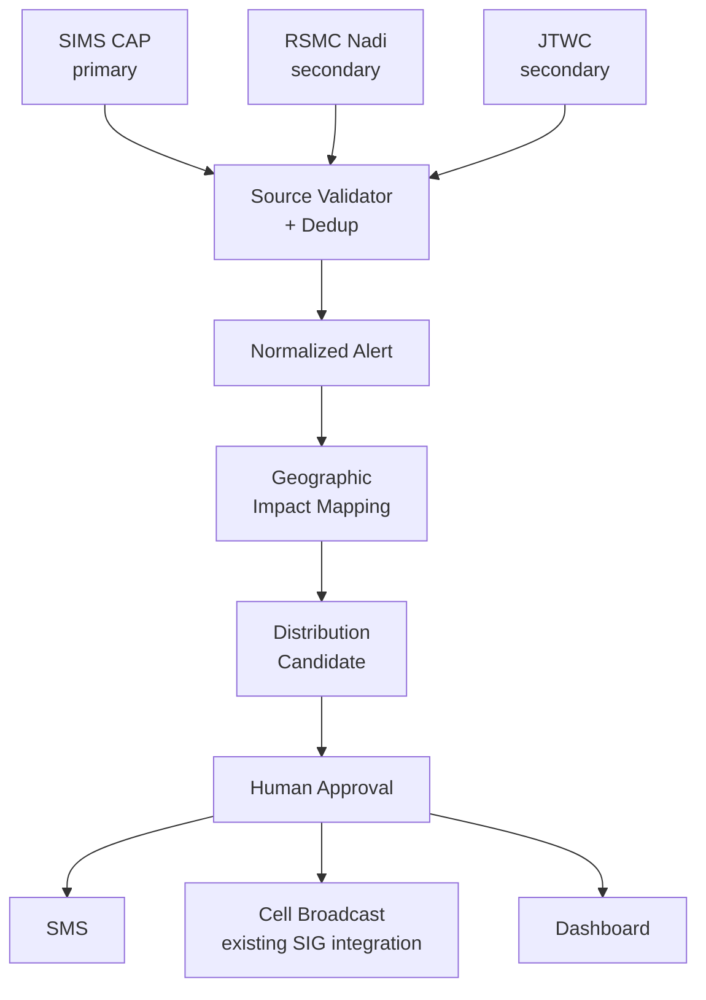

# SI Hazard-Warning Distribution System — What It Is

*A plain-language overview for NDMO, SIMS, and SIG ICT Services. For technical detail, see `README.md` and `docs/PROJECT_HANDOFF.md`.*

## What this system does — and doesn't do

This system watches for official hazard warnings (cyclones, strong wind, and similar events) as they're published, works out which provinces and wards they affect, and — once a person has reviewed and approved the message — sends it out by SMS and, eventually, Cell Broadcast. **It does not decide that a hazard exists.** It never issues a warning, predicts a cyclone's path, or forecasts flooding on its own authority. That job stays entirely with SIMS (the Solomon Islands Meteorological Service) and NDMO. This system is the layer that takes what they've already decided and gets it to the right people, in the right area, through channels people actually have — it is not an independent warning authority, and it is not meant to become one.

## How a warning moves through the system

**Ingest** — The system checks SIMS's official warning feed on a regular schedule and picks up any new warnings it publishes. It also has a manual entry path, for a human operator to enter a warning by hand if the digital feed ever goes down.

**Normalize** — Real warning feeds sometimes republish the same event more than once, or send small corrections. This step recognizes when two warnings are really the same event, so a person doesn't get five text messages about one cyclone. It also checks that each warning still makes sense (for example, that it doesn't claim to expire before it was even received) before passing it on.

**Map** — Every warning covers a geographic area — usually described as a shape on a map, not a list of provinces. This step figures out which provinces, constituencies, and wards actually fall inside that shape, so the message only goes to people who are actually in the affected area, rather than the whole country.

**Approve** — Nothing leaves this system without a named human being reviewing and approving it first. There is no "auto-send" path. The system also has a strict **TEST mode**, used for demonstrations and rehearsals, that is mechanically incapable of reaching a real phone — it's a hard safety switch, not a setting someone could forget to toggle back.

**Send** — Once approved, the message goes out over SMS (and, in future, Cell Broadcast) in the right language, split correctly so a warning doesn't get silently cut off or duplicated by the phone network's message-length limits.

## What's real vs. what's a placeholder today

This section is meant to be quoted back to us — so it's deliberately conservative.

| Piece | Status |
|---|---|
| **SIMS feed ingestion** | Live and working. Tested against real SIMS data, and resilient to a malformed or broken individual warning — one bad item doesn't take down the rest of a batch. |
| **Feed health tracking** | Built and tested. The system knows the difference between "feed is fine," "feed is running late," and "feed has gone silent," so a quiet failure doesn't go unnoticed. |
| **Geographic mapping** | Working, but built on **2009 census-era province boundaries** (the only public dataset found so far) — **explicitly development-only**. Before any real warning is sent, this needs current administrative boundary data from SINSO (National Statistics Office) or the relevant electoral authority. |
| **SMS sending** | The full pipeline (message building, translation, segment-splitting, retry/duplicate-prevention logic) is built and tested — but it currently runs against a mock gateway that simulates a phone network. There is no real SMS gateway account yet. |
| **Cell Broadcast** | Not built. This is deliberate, not an oversight: SIG ICT Services already has a Cell Broadcast pilot in progress, and we don't want to build a duplicate system before confirming exactly what theirs already covers. |
| **Approval and oversight** | The role-based approval system (a second person must sign off before anything sends), the tamper-evident activity log, and per-user sending limits are all built and tested. What's missing is the mapping from those roles to actual named people or offices at NDMO/SIMS/SIG ICT. |
| **Pijin translation** | A placeholder, written to prove the translation mechanism works end-to-end — **it has not been reviewed by a fluent Solomon Islands Pijin speaker, NDMO, or SIMS**, and must not be treated as ready to send to the public. |
| **CAP feed authenticity** *(new finding, 22 Sep 2026)* | SIMS's warning feed is digitally signed, which is meant to prove a message is genuine and untampered. Checking this tonight found the signature doesn't verify under standard, correct cryptographic tools, and the certificate attached to it identifies a third-party relay service ("Alert Hub"), not SIMS directly. This needs SIMS/NDMO to confirm what is actually signing these messages before the feed can be cryptographically trusted end-to-end — see below. |

## What this needs from your organization

- **Who has the authority to approve a public send?** The approval mechanism is built; it needs to be pointed at real people or offices.
- **What does SIG ICT's existing Cell Broadcast integration already cover?** This determines what (if anything) still needs building on that channel.
- **A reviewed Pijin translation** of warning message templates, from a qualified Solomon Islands Pijin speaker, sign off from NDMO/SIMS.
- **Current administrative boundary data** (post-2009) from SINSO or the relevant electoral authority, to replace the development-only province boundaries currently in use.
- **Confirmation of what signs SIMS's CAP feed**, and whether there's a genuine SIMS-specific key that can be obtained directly from SIMS (rather than via the third-party relay) — needed before the feed's authenticity can be verified end-to-end rather than just trusted on faith.

## Architecture (for reference)

